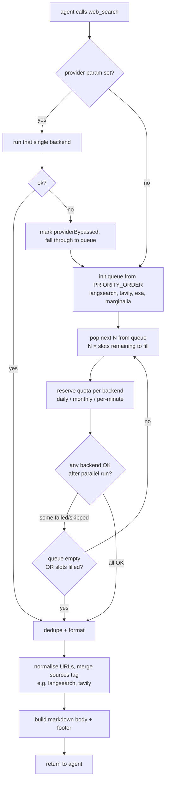

# web_search

Pi extension. Registers a `web_search` tool that fans out across multiple search
backends in parallel, dedupes results by URL, and returns markdown-formatted
output with per-result source tags.

## What it does

- Default priority queue: `langsearch -> tavily -> exa -> marginalia`.
- Default fan-out: top 2 backends in parallel per call.
- Quota-exhausted or failing backends are skipped; the queue auto-promotes the
  next backend until 2 succeed or the queue is empty.
- Dedupes by URL with normalisation (strip `utm_*`, `gclid`, `fbclid`, trailing
  slashes, fragments). When the same URL is returned by both backends, the
  source tag becomes `(langsearch, marginalia)`.
- Optional `provider` param forces a single backend; if that backend is
  unavailable (quota / rate / error), falls through to the queue and the footer
  reports the bypass.
- Provenance footer per call: query, dedupe result count, total duration,
  per-backend status with count and ms.
- TUI rendering folds long result lists by default. Collapsed view shows the
  first 5 results, a `... (N more results, M total, ctrl+o to expand)`
  separator, and the full provenance footer. Cut is result-boundary aware (never
  mid-result). `app.tools.expand` (ctrl+o) toggles to the full view. The LLM
  always receives the unfolded content.
- `renderCall` displays `web_search "<query>"` plus `(provider: <name>)` when a
  backend override is set.

## Flow



## Backends and free-tier quotas

| Backend    | Endpoint                                | Auth                    | Free quota              |
| ---------- | --------------------------------------- | ----------------------- | ----------------------- |
| LangSearch | `POST api.langsearch.com/v1/web-search` | `Authorization: Bearer` | 1,000/day, 60 RPM       |
| Tavily     | `POST api.tavily.com/search`            | `api_key` in body       | 1,000/month             |
| Exa        | `POST api.exa.ai/search`                | `x-api-key` header      | 1,000/month, 600 RPM    |
| Marginalia | `GET api2.marginalia-search.com/search` | `API-Key` header        | unmetered (shared pool) |

LangSearch is the workhorse (largest renewable daily pool). Tavily is the second
default for agent-tuned snippets. Exa sits in the spillover tail. Marginalia is
last in priority because its BM25 keyword index downranks commercial /
mainstream pages by design - useless for "Star Wars APIs" or "Datadog pricing"
style queries, valuable for indie tech blogs. Force it explicitly with
`provider="marginalia"` when the answer lives in indie / long-tail content.

## Installation

1. Drop API keys into the auth file (defaults to
   `~/OneDrive/work/mac-pro/dotfiles/web-search-auth.json`):

   ```json
   {
     "langsearch": { "apiKey": "..." },
     "tavily": { "apiKey": "..." },
     "exa": { "apiKey": "..." },
     "marginalia": { "apiKey": "public" }
   }
   ```

   Override the location with `WEB_SEARCH_AUTH_PATH=<file>` if needed.

2. The extension is symlinked into pi via the whole-dir symlink set up in
   `AI-Config-README.md`. Reload pi or restart.

## Parameters

| Name         | Type                      | Default | Notes                                       |
| ------------ | ------------------------- | ------- | ------------------------------------------- |
| `query`      | string                    | -       | Plain English or keywords.                  |
| `numResults` | integer (opt., 1-20)      | 3       | Per backend; total before dedupe is 2x.     |
| `provider`   | enum of backends (opt.)   | -       | Force one backend; bypassed if unavailable. |
| `timeoutMs`  | integer (opt., 1000-300k) | 30000   | Per-request timeout.                        |

## ADRs

### Priority queue with auto-fallback over user-selected pair

A single ordered list of backends collapses three earlier proposals (quality
preset, parallel-fixed-pair, manual spillover) into one mental model. Top N run
in parallel; failure or quota promotes the next backend. Same code handles the
common case, the failure case, and the quota-exhausted case.

### `provider` override bypasses to queue on failure

Allows targeted backend selection (e.g. "Marginalia for indie blogs") without
hard-failing the tool when that one backend is quota-exhausted. The footer notes
the bypass so the agent can see what actually ran.

### Auth in OneDrive JSON, not env vars

JSON keeps the structure clean for future per-backend options (caps, custom
endpoints, multiple keys per backend if we ever add them). Lives outside the
git-tracked dotfiles repo (`~/OneDrive/work/mac-pro/dotfiles/...`) so secrets
sync across machines without being committed.

### Single counter file, per-day + per-month tracked together

`~/.pi/web-search-usage.json` holds `{day, monthKey, today, month}` per backend.
Lazy reset on read: if the stored day != today, today resets to 0; same for
monthKey. Per-minute is in-memory only (resets on pi restart, fine because a
60-second window restarts every minute anyway).

### URL normalisation for dedupe

Strip `utm_*`, `gclid`, `fbclid` query params; strip trailing slash from path;
drop URL fragment. Catches the common case where two backends return the same
article under different tracking parameters. Does NOT normalise scheme or host
(`http`/`https`, `www`/non-`www`) - too aggressive for the cost.

### Use `summary` over `snippet` from LangSearch and Exa

Snippets are 100-200 chars and rarely answer agent queries. `summary` fields are
1-3KB but query-aware. Token budget per call (numResults=3, 2 backends) is
~2,100 tokens - trivial on 1M context, tolerable on 200K. Raise `numResults` up
to 20 per call when more breadth is needed.

### Marginalia defaults to `public` key

The public sample key works without signup and matches the docs' recommended
prototyping pattern. Often returns 503 under load (shared rate-limit pool).
Replace with a real free key via email to `contact@marginalia-search.com` once
503s become routine.

### `typebox` over hand-written JSON Schema

Pi bundles `typebox` (per the official Available Imports list). Gives typed
parameters and pi-recognised schema. No install. The `provider` enum uses
`Type.Union(Type.Literal(...))` - skips the Google-compat `StringEnum` helper
from `@earendil-works/pi-ai` since we are not driving the agent with Gemini.
Switch to `StringEnum` later if Gemini becomes the driver.

### Treat all backend response fields as untrusted

Each adapter validates fields via `asString` / `asArray` / `asObject` helpers in
`http.ts`. A result without a `url` is dropped, not crashed-on. Vendors change
response shapes silently; this isolates the blast radius to "fewer results"
rather than "tool throws".

### Provenance footer on every call

Mirrors `web_fetch`'s footer pattern. Lets the LLM (and any future log reader)
see which backends ran, which were skipped, which errored, and how long the
whole thing took. The `details` object on the tool result holds the same data
structurally for pi's UI.

## Limitations

- TLS fingerprinting isn't a concern here (we hit JSON APIs, not bot-protected
  HTML), but each vendor has its own rate-limiting and bot-detection.
- Marginalia is English-only and BM25-keyword based; bad for natural-language
  queries and non-English content.
- Tavily and Exa burn 1k/month free quota - heavy days will exhaust them early.
  Spillover to LangSearch (1k/day) covers the gap.
- No POST-style search, no per-domain filters, no time-range filters. Add as
  optional `parameters` later if needed.
- Per-minute rate-limit window lives in process memory only; restart resets it.
  Acceptable because a 60s window resets every minute anyway.
