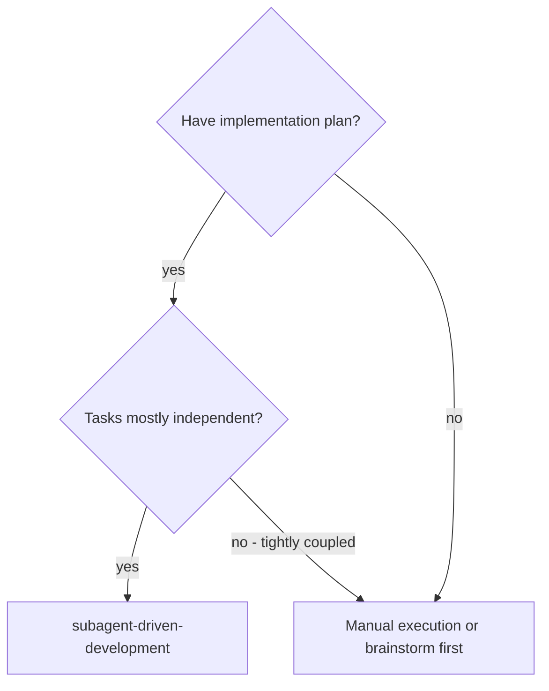
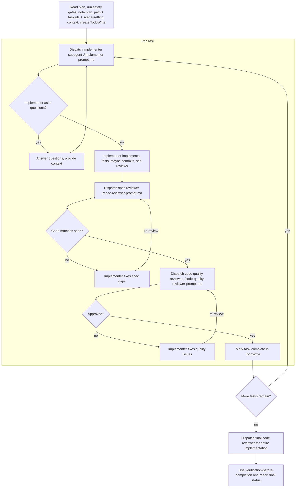

# Subagent-driven development

Execute plan by dispatching fresh subagent per task, with two-stage review after
each: spec compliance review first, then code quality review.

**Why subagents:** Fresh subagent per task + two-stage review (spec then
quality) = high quality, fast iteration. Isolated context per task; subagents
never inherit session history, controller constructs exactly what they need and
coordinates only, preserving its context for orchestration.

**Continuous execution:** Do not pause to check in with your human partner
between tasks. Execute all tasks from the plan without stopping. The only
reasons to stop are: BLOCKED status you cannot resolve, ambiguity that genuinely
prevents progress, or all tasks complete. "Should I continue?" prompts and
progress summaries waste their time — they asked you to execute the plan, so
execute it.

## Branch safety

Before implementation, inspect the current branch.

If on `main` or `master`, ask which path to use:

1. Create a feature branch in the current working tree
2. Create a worktree under `.worktrees/<branch-name>/` in the current working
   directory
3. Continue on `main` or `master`

Recommend a feature branch for simple work. Recommend a worktree for risky work,
parallel work, or changes that need stronger isolation.

Continuing on `main` or `master` requires explicit user consent.

When creating a worktree, ensure `.worktrees/` is listed in the target repo
`.gitignore`. Add it first if missing.

## Plan tracking

If the plan file uses checkboxes, ask before editing it to track progress.

If approved, preserve all original content except checkbox state. Update each
task checkbox from `- [ ]` to `- [x]` immediately after the task is implemented,
verified, and approved by both reviewers. Do not batch checkbox updates at the
end.

If not approved, track progress with TodoWrite and chat status only.

## Commit policy

Read the plan for its commit policy.

If the plan has no commit policy, ask before implementation:

```markdown
How should commits be handled for this plan?

**A**. One commit per task **B**. One commit at the end **C**. No commits
```

Follow the selected policy. Never commit when the policy is `No commits`.

## When to use



## The process



Before dispatching subagents:

1. Read the plan file once. STOP if `plan_path` was not provided OR the file
   does not exist OR is empty. Ask the user for a valid plan file before
   proceeding. Skills load at the step that needs them (see step annotations
   `**Skills (load if not already loaded):**` in the plan) - implementer
   subagents handle that themselves. Do NOT pre-load skills upfront
2. Run branch safety gate
3. Run plan tracking gate
4. Resolve commit policy
5. Note `plan_path`, task ids, and scene-setting context per task. Do NOT
   extract task text verbatim - subagents read the plan themselves via pointers
6. Create TodoWrite

Tell implementer subagents the selected commit policy:

- `One commit per task`: commit after that task is implemented and verified
- `One commit at the end`: do not commit during individual tasks
- `No commits`: do not commit

## `base_ref` discovery

Capture two values:

1. Plan-level (final reviewer): `git merge-base HEAD <default-branch>` where
   default-branch is `main` or `master` (detect with
   `git symbolic-ref refs/remotes/origin/HEAD`)
2. Per-task (per-task reviewers): capture `git rev-parse HEAD` at task start,
   before dispatching the implementer. Per-task `base_ref` = that SHA. Task 1's
   base equals the plan-level merge-base only on a clean branch with no prior
   commits; otherwise it's whatever HEAD is at task start
3. With `One commit per task`, per-task base shifts after each commit; recapture
   at the start of each task

**Preconditions before dispatching:**

1. Worktree clean of unrelated changes. Dirty at task start: ask the user before
   proceeding (otherwise reviewers audit user's WIP edits)
2. `changed_files` captured at task end, BEFORE any per-task commit. After
   `git commit`, `git status --porcelain` returns empty; derive from
   `git diff --name-only <task_base_ref>...HEAD` instead. For renames, use the
   destination path

## Model selection

Use the least powerful model that handles each role.

- 1-2 files, complete spec, mechanical implementation → cheap/fast model
- Multi-file integration, pattern matching, debugging → standard model
- Architecture, design, review, broad codebase reasoning → most capable model

## Handling implementer status

Implementer subagents report one of four statuses. Handle each appropriately:

**DONE:** Proceed to spec compliance review.

**DONE_WITH_CONCERNS:** The implementer completed the work but flagged doubts.
Read the concerns before proceeding. If the concerns are about correctness or
scope, address them before review. If they're observations (e.g., "this file is
getting large"), note them and proceed to review.

**NEEDS_CONTEXT:** The implementer needs information that wasn't provided.
Provide the missing context and re-dispatch.

**BLOCKED:** The implementer cannot complete the task. Assess the blocker:

1. If it's a context problem, provide more context and re-dispatch with the same
   model
2. If the task requires more reasoning, re-dispatch with a more capable model
3. If the task is too large, break it into smaller pieces
4. If the plan itself is wrong, escalate to the human

**Never** ignore an escalation or force the same model to retry without changes.
If the implementer said it's stuck, something needs to change.

## Review retry budget

3 rounds per reviewer (spec, code-quality, AND final reviewer). One round = one
dispatch + one implementer fix attempt. Round 4: STOP. Escalate with the
reviewer's latest issues and the implementer's latest attempt.

Repeated rejection often signals a plan defect, not a fix defect. Escalation
gives the user a chance to update the plan.

## Dispatch payloads

Do NOT read or open the template files yourself — each subagent reads its
template. Reading them into your own context defeats the offload. Pass the
absolute template path + the values it needs.

Conventions:

- `<skill_dir>` resolves to the directory of THIS SKILL.md (e.g.
  `/Users/me/.claude/skills/subagent-driven-development`). Substitute the real
  absolute path before sending
- `changed_files` is a SPACE-separated list of paths suitable for use after `--`
  in git commands (e.g. `src/a.ts src/b.ts`). No JSON, no commas, no brackets
- Pass the `MUST read instructions at ...` line plus values; never paste the
  template body into the prompt

**Implementer:**

```text
MUST read instructions at <skill_dir>/implementer-prompt.md FIRST. Do not
act until you have read it. Then apply:
  task_summary  = <one-line summary of the task>
  plan_path     = <abs path>
  task_id       = <task number / heading>
  working_dir   = <abs path>
  commit_policy = <One commit per task | One commit at the end | No commits>
  context       = <scene-setting only: where this task fits, prior task
                   outputs, dependencies, architectural notes not in the plan>
```

**Spec compliance reviewer:**

```text
MUST read instructions at <skill_dir>/spec-reviewer-prompt.md FIRST. Do not
act until you have read it. Then apply:
  task_summary  = <one-line summary of the task>
  plan_path     = <abs path>
  task_id       = <task number / heading>
  base_ref      = <SHA at task start, or merge-base for final review>
  changed_files = <space-separated paths>
```

**Code quality reviewer:**

```text
MUST read instructions at <skill_dir>/code-quality-reviewer-prompt.md FIRST.
Do not act until you have read it. Then apply:
  description          = <one-line task summary>
  plan_or_requirements = "Task <task_id> from <plan_path>"
  base_ref             = <SHA>
  changed_files        = <space-separated paths>
```

## Red flags

**Never:**

- Start implementation on main/master branch without explicit user consent
- Skip reviews (spec compliance OR code quality), or proceed with unfixed issues
- Dispatch multiple implementation subagents in parallel (conflicts)
- Paste full task text into the prompt (pass `plan_path` + `task_id` only)
- Skip scene-setting context (subagent needs to understand where task fits)
- Ignore subagent questions (answer before letting them proceed)
- Accept "close enough" on spec compliance (spec reviewer found issues = not
  done)
- Let implementer self-review replace actual review (both are needed)
- **Start code quality review before spec compliance is ✅** (wrong order)
- Move to next task while either review has open issues
- Fix a failed subagent's task manually (context pollution); dispatch a fix
  subagent with specific instructions

## Integration

**Related workflow skills:**

- **./code-quality-reviewer-prompt.md** - Code review template (wraps
  `requesting-code-review`)
- **verification-before-completion** - Verifies before claiming completion
