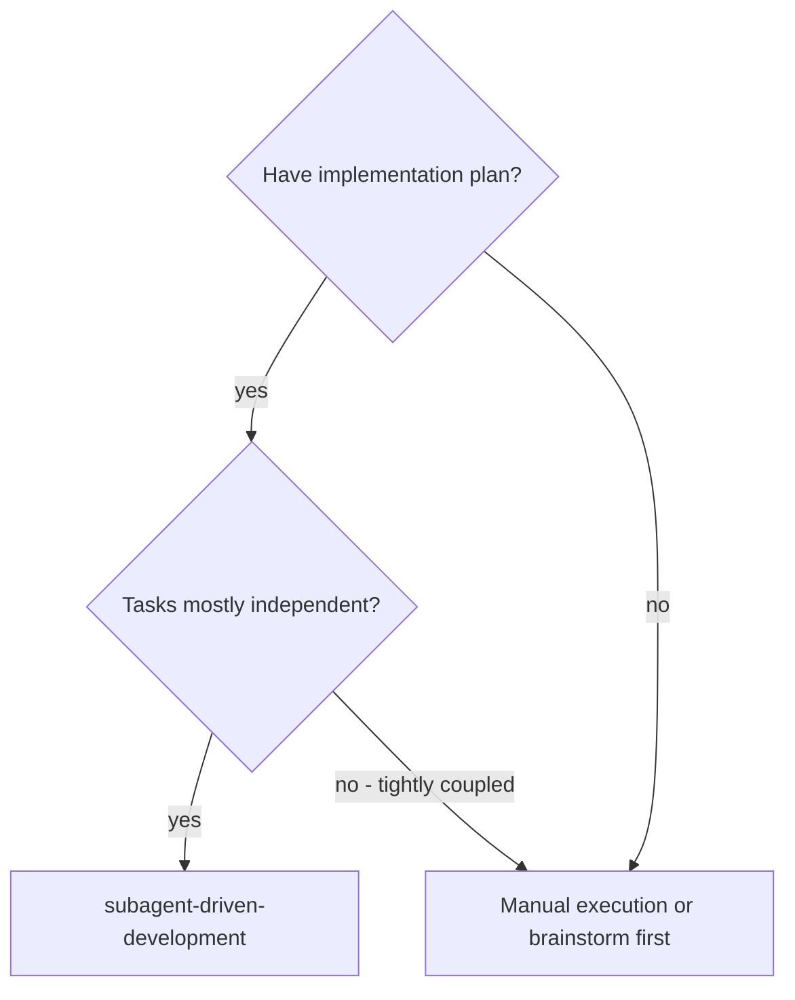
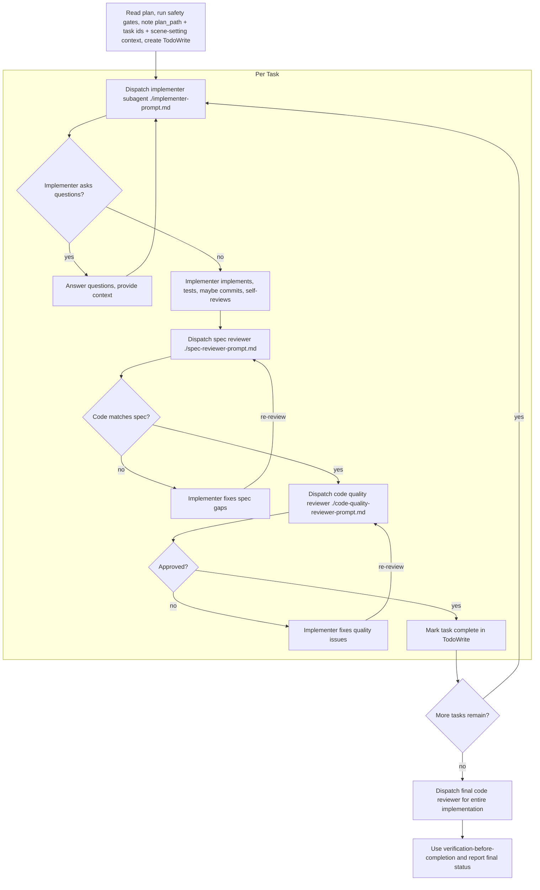

# Subagent-driven development

**Requires `executing-plans`.** This skill is the subagent-per-task MODE of that
one, not a standalone workflow. `executing-plans` owns everything both modes
share: branch safety, commit policy, plan tracking, `base_ref` discovery,
dispatch preconditions, the re-review decision rule, the retry budget, and the
reviewer dispatch payloads. This file holds only what differs when a subagent
implements instead of you.

If `executing-plans` is not already loaded in this session, load it now, before
anything else. You reached here from its execution workflow gate
(`executing-plans` → "Execution workflow gate"), so normally it already is.

Execute plan by dispatching fresh subagent per task, with two-stage review after
each: spec compliance review first, then code quality review.

**Why subagents:** Fresh subagent per task + two-stage review (spec then
quality) = high quality, fast iteration. Isolated context per task; subagents
never inherit session history, controller constructs exactly what they need and
coordinates only, preserving its context for orchestration.

**Continuous execution:** Do not pause to check in with your human partner
between tasks. Execute all tasks from the plan without stopping. The only
reasons to stop are: BLOCKED status you cannot resolve, ambiguity that genuinely
prevents progress, or all tasks complete. "Should I continue?" prompts and
progress summaries waste their time — they asked you to execute the plan, so
execute it.

## When to use


```mermaid
flowchart TD
    P{Have implementation plan?} -->|yes| I{Tasks mostly independent?}
    P -->|no| M[Manual execution or brainstorm first]
    I -->|yes| S[subagent-driven-development]
    I -->|"no - tightly coupled"| M
```

## The process


```mermaid
flowchart TD
    Start[Read plan, run safety gates, note plan_path + task ids + scene-setting context, create TodoWrite] --> Disp

    subgraph PerTask[Per Task]
        Disp[Dispatch implementer subagent ./implementer-prompt.md] --> Q{Implementer asks questions?}
        Q -->|yes| Ans[Answer questions, provide context] --> Disp
        Q -->|no| Impl[Implementer implements, tests, maybe commits, self-reviews]
        Impl --> Spec[Dispatch spec reviewer ./spec-reviewer-prompt.md]
        Spec --> SpecOk{Code matches spec?}
        SpecOk -->|no| SpecFix[Implementer fixes spec gaps] -->|re-review| Spec
        SpecOk -->|yes| CQ[Dispatch code quality reviewer ./code-quality-reviewer-prompt.md]
        CQ --> CQOk{Approved?}
        CQOk -->|no| CQFix[Implementer fixes quality issues] -->|re-review| CQ
        CQOk -->|yes| Done[Mark task complete in TodoWrite]
    end

    Done --> More{More tasks remain?}
    More -->|yes| Disp
    More -->|no| Final[Dispatch final code reviewer for entire implementation]
    Final --> Verify[Use verification-before-completion and report final status]
```

Before dispatching subagents:

1. Read the plan file once. STOP if `plan_path` was not provided OR the file
   does not exist OR is empty. Ask the user for a valid plan file before
   proceeding. Skills load at the step that needs them (see step annotations
   `**Skills (load if not already loaded):**` in the plan) - implementer
   subagents handle that themselves. Do NOT pre-load skills upfront
2. Run the shared gates from `executing-plans`: branch safety, plan tracking,
   commit policy
3. Note `plan_path`, task ids, and scene-setting context per task. Do NOT
   extract task text verbatim - subagents read the plan themselves via pointers
4. Create TodoWrite

Tell implementer subagents the selected commit policy:

- `One commit per task`: commit after that task is implemented and verified
- `One commit at the end`: do not commit during individual tasks
- `No commits`: do not commit

## Extra precondition in this mode

`executing-plans` → "Reviewer dispatch pointers" holds `base_ref` discovery and
the shared preconditions. Capture per-task `base_ref` at task start, **before
dispatching the implementer**. One precondition is specific to this mode:

- The implementer reported a full gate that passed. Reviewers are told not to
  run one, so dispatching without this ships unvalidated code. No reported gate,
  or a failing one: send the implementer back — do not run it yourself, and do
  not dispatch reviewers

## You orchestrate, you do not validate or commit

Never run a test, lint, type-check, or build command yourself. Not to check the
implementer's work, not to confirm a fix, not "just quickly".

**You also do not commit.** Whoever writes code commits it, after gating it: the
implementer for its task, the fix subagent for its fix. Reviewers are read-only
and never commit. You own only the plan file's checkboxes.

Sole exception: under `One commit at the end` you told every implementer not to
commit, so at the very end no other agent is alive to do it. You commit once,
after the final gate.

Two reasons, both load-bearing:

- Command output floods your context, and an orchestrator holding build output
  drifts into implementation mode — it starts fixing things directly and stops
  dispatching the subagents that make this workflow work
- Your context is the coordination budget for the whole plan. Spend it on
  dispatching and on reading reports, nothing else

Something needs running: dispatch an agent to run it. The implementer runs the
task's gate; reviewers run narrow single-test checks to substantiate a finding.

**One exception, at the very end.** After the last task and the final review,
you make the completion claim, and `verification-before-completion`'s Iron Law
says a claim needs evidence you ran yourself — so you run the final gate. That
is one command, once, with no tasks left to dispatch, so the drift it would
cause has nothing left to damage. It is the only command of this kind you ever
run.

## Model selection

Use the least powerful model that handles each role.

- 1-2 files, complete spec, mechanical implementation → cheap/fast model
- Multi-file integration, pattern matching, debugging → standard model
- Architecture, design, review, broad codebase reasoning → most capable model

## Handling implementer status

Implementer subagents report one of four statuses. Handle each appropriately:

**DONE:** Proceed to spec compliance review.

**DONE_WITH_CONCERNS:** The implementer completed the work but flagged doubts.
Read the concerns before proceeding. If the concerns are about correctness or
scope, address them before review. If they're observations (e.g., "this file is
getting large"), note them and proceed to review.

**NEEDS_CONTEXT:** The implementer needs information that wasn't provided.
Provide the missing context and re-dispatch.

**BLOCKED:** The implementer cannot complete the task. Assess the blocker:

1. If it's a context problem, provide more context and re-dispatch with the same
   model
2. If the task requires more reasoning, re-dispatch with a more capable model
3. If the task is too large, break it into smaller pieces
4. If the plan itself is wrong, escalate to the human

**Never** ignore an escalation or force the same model to retry without changes.
If the implementer said it's stuck, something needs to change.

## Dispatch payloads

Do NOT read or open the template files yourself — each subagent reads its
template. Reading them into your own context defeats the offload. Pass the
absolute template path + the values it needs.

Conventions:

- `<skill_dir>` resolves to the directory of THIS SKILL.md (e.g.
  `/Users/me/.claude/skills/subagent-driven-development`). Substitute the real
  absolute path before sending
- `changed_files` is a SPACE-separated list of paths suitable for use after `--`
  in git commands (e.g. `src/a.ts src/b.ts`). No JSON, no commas, no brackets
- Pass the `MUST read instructions at ...` line plus values; never paste the
  template body into the prompt

**Implementer:**

```text
MUST read instructions at <skill_dir>/implementer-prompt.md FIRST. Do not
act until you have read it. Then apply:
  task_summary  = <one-line summary of the task>
  plan_path     = <abs path>
  task_id       = <task number / heading>
  working_dir   = <abs path>
  commit_policy = <One commit per task | One commit at the end | No commits>
  context       = <scene-setting only: where this task fits, prior task
                   outputs, dependencies, architectural notes not in the plan>
```

**Both reviewers:** identical to inline mode — see `executing-plans` → "Reviewer
dispatch pointers" for the two payloads. Same templates, same values, and both
templates live in THIS directory.

## Red flags

`executing-plans` → "Red flags" applies in full. These are additional, and all
of them are specific to dispatching implementers:

**Never:**

- Dispatch multiple implementation subagents in parallel (conflicts)
- Paste full task text into the prompt (pass `plan_path` + `task_id` only)
- Skip scene-setting context (subagent needs to understand where task fits)
- Ignore subagent questions (answer before letting them proceed)
- Fix a failed subagent's task manually (context pollution); dispatch a fix
  subagent with specific instructions
- Accept "close enough" on spec compliance (spec reviewer found issues = not
  done)

## Integration

**Related workflow skills:**

- **./code-quality-reviewer-prompt.md** - Code review template (wraps
  `requesting-code-review`)
- **verification-before-completion** - Verifies before claiming completion
